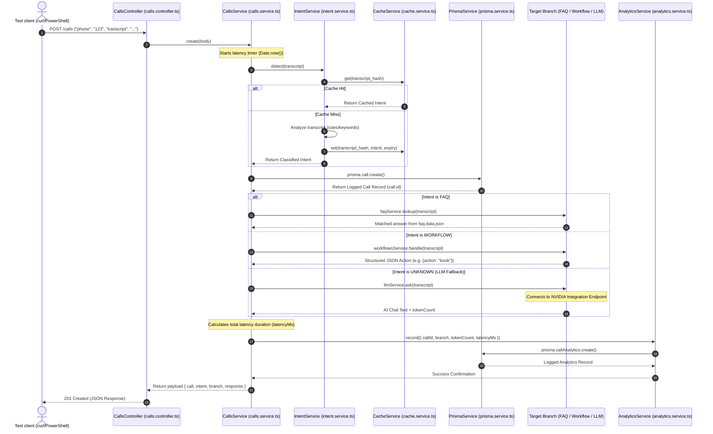

# Project Flow Document

This document explains the complete, detailed end-to-end architecture, file structure, and step-by-step data flow of the `ai-calling-backend` application.

## Technology Stack
- **Framework**: NestJS (TypeScript Node.js Framework)
- **Database**: PostgreSQL (relational storage managed via Prisma ORM)
- **Caching & Intent Storage**: Redis (high-performance key-value store via `ioredis`)
- **LLM Integration**: OpenAI SDK (configured to route to the NVIDIA Llama-3.1-8b API)

---

## Detailed Directory and File Structure

```text
src/
├── app.module.ts            # Root application module importing all service modules
├── main.ts                  # Application bootstrapper launching NestJS server (default: port 3000)
├── prisma/
│   ├── prisma.module.ts     # Exports PrismaService for injection
│   └── prisma.service.ts    # Configures PrismaClient using PostgreSQL pg-adapter
├── redis/
│   ├── redis.constants.ts   # Holds dependency injection tokens (REDIS_CLIENT)
│   ├── redis.module.ts      # Instantiates the 'ioredis' client with port fail-safe logic
│   └── cache.service.ts     # Interface for cache lookups/writes using Redis
├── intent/
│   ├── intent.module.ts     # Exports IntentService to analyze transcripts
│   └── intent.service.ts    # Service executing intent classification with Redis caching
├── faq/
│   ├── faq.data.json        # Static JSON dataset mapping common questions to answers
│   ├── faq.module.ts        # Exports FaqService
│   └── faq.service.ts       # Handles structural lookup for Intent.FAQ
├── workflows/
│   ├── workflows.module.ts  # Exports WorkflowsService
│   └── workflows.service.ts # Returns structured JSON actions for Intent.WORKFLOW
├── llm/
│   ├── llm.module.ts        # Exports LlmService
│   └── llm.service.ts       # Query fallback using the NVIDIA API
├── analytics/
│   ├── analytics.module.ts  # Configures analytics endpoints and routing
│   ├── analytics.controller.ts # GET /analytics/summary endpoint mapping
│   └── analytics.service.ts # Persists metrics and pulls performance summaries from Postgres
└── calls/
    ├── calls.module.ts      # Wires up routes for Call processing
    ├── calls.controller.ts  # Handles GET /calls and POST /calls endpoints
    └── calls.service.ts     # Orchestrator of the primary call lifecycle and routing
```

---

## End-to-End Dynamic Routing Flow



---

## Step-by-Step Execution Lifecycle Details

### Phase 1: Incoming Request Processing
1. **Network Layer:** Client invokes `POST /calls` with standard JSON payload:
   ```json
   {
     "phone": "1234567890",
     "transcript": "What is the pricing?"
   }
   ```
2. **Controller Routing (`calls.controller.ts`):** The NestJS framework intercepts the HTTP payload in `CallsController.create()`. It injects the request body parameters and routes control immediately to `CallsService.create(body)`.

### Phase 2: Intent Classification & Cache Check
1. **Timer Initialization:** `CallsService.create()` records the current time (`const startTime = Date.now()`) to track exact server latency.
2. **Intent Parsing (`intent.service.ts`):** 
   - `IntentService.detect()` normalizes the input transcript.
   - It invokes `CacheService` to search for a pre-classified intent match in Redis using a key formed from the transcript.
   - **On Cache Hit:** If found, the classified intent is returned immediately, saving computational cycles.
   - **On Cache Miss:** The service runs classification rules (e.g., matching keywords like "appointment" ➔ `WORKFLOW`, "price" ➔ `FAQ`). The result is saved to Redis using `cacheService.set()` with a TTL (Time-To-Live) and then returned.

### Phase 3: Postgres Call Logging
1. **Prisma Persistence:** `CallsService` saves the new session transaction to the SQL Database:
   ```typescript
   const call = await this.prisma.call.create({
     data: {
       phone: body.phone,
       intent: detectedIntent,
       transcript: body.transcript,
     },
   });
   ```
   This generates a unique database session UUID (`call.id`) that acts as a foreign key for subsequent analytics.

### Phase 4: Business Branch Evaluation
The system evaluates the intent and routes the payload to the specific sub-service:
* **FAQ Service (`faq.service.ts`):** Imports the static questions database (`faq.data.json`). It performs a substring match against the caller's transcript and returns the associated text response.
* **Workflows Service (`workflows.service.ts`):** Evaluates transactional steps. If the transcript implies an action like booking an appointment, it outputs structured data outlining the execution step:
  ```json
  { "action": "book", "step": "slots" }
  ```
* **LLM Fallback Service (`llm.service.ts`):** Handles general conversational transcripts (`Intent.UNKNOWN`).
  - Instantiates the `openai` SDK client pointing to `https://integrate.api.nvidia.com/v1`.
  - Runs a Chat Completion call to `meta/llama-3.1-8b-instruct`.
  - Swallows network/API errors gracefully using `try/catch` and returns both the completion text response and the usage token metrics.

### Phase 5: Analytics and Metrics Recording
1. **Latency Calculation:** The system computes execution duration:
   ```typescript
   const latencyMs = Date.now() - startTime;
   ```
2. **Metrics Insertion (`analytics.service.ts`):** Passes metrics parameters to `AnalyticsService.record()`:
   ```typescript
   await this.prisma.callAnalytics.create({
     data: {
       callId,
       branch,
       tokenCount,
       latencyMs,
     },
   });
   ```
3. **Response Assembly:** `CallsService` returns a structured execution receipt to the controller containing the database `call` log, classified `intent`, routed `branch`, and resolved service `response`.
4. **HTTP Return:** `CallsController` serves the compiled JSON payload with a `201 Created` status code.
