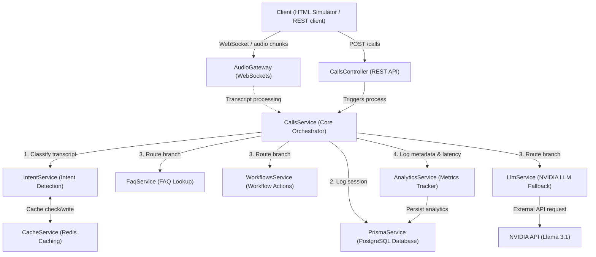

# AI Calling Backend

A backend service built with [NestJS](https://nestjs.com/), designed to handle AI calling flows, intent detection, and logging. 

## Tech Stack
- **Framework:** NestJS
- **Database:** PostgreSQL
- **ORM:** Prisma
- **Caching/Queueing:** Redis (via BullMQ)

## Architecture

Below is the high-level architecture showing how the client interfaces with the NestJS application layers, services, and backing stores:



## Getting Started

### 1. Prerequisites
- [Node.js](https://nodejs.org/en/) (v16+ recommended)
- [Docker & Docker Desktop](https://www.docker.com/products/docker-desktop) (for running Postgres & Redis locally)

### 2. Infrastructure Setup
Make sure Docker Desktop is running, then start the local PostgreSQL and Redis containers in the background:
```bash
docker-compose up -d
```

### 3. Install Dependencies
```bash
npm install
```

### 4. Database Setup
Ensure your `.env` file is set up with your database URL, then push the Prisma schema to create your tables:
```bash
npx prisma db push
```
*(If you make changes to `schema.prisma`, run `npx prisma generate` to update the client).*

### 5. Running the App
```bash
# development
npm run start

# watch mode (recommended)
npm run start:dev

# production mode
npm run start:prod
```

## Documentation

For a detailed breakdown of the database schema, internal modules, and flow, please refer to the [Project Flow Document](./PROJECT_FLOW.md).

## Core API Endpoints

- `GET /calls`: Retrieves all call records.
- `POST /calls`: Creates a new call record. It will automatically parse the `transcript` to detect the `intent`.
- `POST /intent`: A standalone endpoint to detect intent from a provided transcript.
